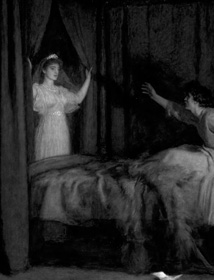

# Vâlvă

*Vâlve are Romanian female spirits and shapeshifters.*

Vâlvă is a small footprint JS library dedicated to transitions.  
When a full-fledge framework is overkill, but relying solely on CSS is not an option.

Now v.1.1!

## Demo

Quick and dirty demo available in `docs/` or as a [Github Page](https://i-is-as-i-does.github.io/Valva/)

## Use

### Browser

```html
<script src="path/to/assets/Valva.min.js"></script>
```

### Node

```bash
npm install @i-is-as-i-does/valva
```

```js
import Valva from '@i-is-as-i-does/valva';
```

#### Important

Beware of adjacent elements with margin and/or padding. Vâlvă does not modify those.  
If you're experiencing some unexpected jumps, try to wrap your animated element into a neutral, no-margin no-padding parent element.

## Builds

Valva  
`dist/Valva.js` | `dist/Valva.min.js`  
  
ValvaAs  
contains aliases and support for Valva v.1.0
`dist/ValvaAs.js` | `dist/ValvaAs.min.js` 

### Bonus  

Vue 3 component in `src/vue`

## Overview

\* = required  
`type` = ease, fade or ease (aka slide+fade)  
  
Fade-in, slide-down or ease-in, depending on {type} 
```js
vShow(elm*, type, duration, callback, timing)
```

Fade-out, slide-up or ease-out, depending on {type} 
```js
vHide(elm*, type, duration, callback, timing)
```

Fade-toggle, slide-toggle or ease-toggle, depending on {type} 
```js
vToggle(elm*, type, duration, callback, timing)
```

Toggle visibility, wait for {delay}, toggle back
```js
vTempToggle(elm*, type, delay, duration, callback, timing)
```

Toggle visibility, resolve {callback}, toggle back
```js
vToggleResolve(elm*, callback, type, duration1, duration2, timing, reverse)
```

Smooth append element to DOM
```js
vPlace(parent*, child*, prepend, type, duration, callback,timing) 
```

Smooth replace element in DOM
```js
vReplace(oldElm*, newElm*, duration, callback, timing)
```

Will `fade` if {elm} height = {prevHeight}, `ease` otherwise
```js
vShowAdapt(elm*, prevHeight*, duration, callback, timing)
```

Mesmerizing airport letter board effect
```js
vSplitFlap(elm*, text*, speed) 
```

### Defaults

```js
type: 'ease' // aka slide+fade
duration: 300 // in ms
callback: null // function to execute once transition is done
timing: 'ease-in-out' // CSS timing function

delay: 1000 // vTempToggle
reverse: false // vToggleResolve
prepend: false // vPlace
speed: 20 // vSplitFlap

ease: true // insertDiversion & diversionToggle
```

## Aliases

Available in `ValvaAs`  
Mainly for Valva v1.0 support  

### Slide up/down

```js
slideUp(elm*, duration, callback, timing)
slideDown(elm*, duration, callback, timing)
slideToggle(elm*, duration, callback, timing)
timedSlideToggle(elm*, duration, delay, callback, timing)
```

### Fade in/out

```js
fadeOut(elm*, callback, duration, timing)
fadeIn(elm*, callback, duration, timing)
fadeToggle(elm*, callback, duration, timing)
timedFadeToggle(elm*, delay, callback, duration, timing)
```

### Ease in/out

```js
easeOut(elm*, duration, callback, timing)
easeIn(elm*, duration, callback, timing)
easeToggle(elm*, duration, callback, timing)
timedEaseToggle(elm*, delay, duration, callback, timing)
```

### Text split flap

```js
splitFlap(elm*, text*, speed = 20)
```

### Diversions

aka DOM modification helpers

```js
diversionToggle(elm*, callback, ease, duration, reverse, timing)
insertDiversion(parent*, child*, prepend, ease, duration, callback, timing)
replaceDiversion(oldElm*, newElm*, callback, duration, timing)
```

## Contributing

Sure! You can take a loot at [CONTRIBUTING](CONTRIBUTING.md).

## License

This project is under the MIT License; cf. [LICENSE](LICENSE) for details.

  
John Everett Millais, *The Apparition*, 1895
