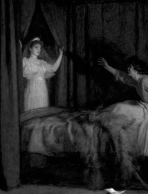

# Vâlvă

*Vâlve are Romanian female spirits and shapeshifters.*

Vâlvă is a small JS library for elegant transitions.  
When a full-fledge framework is overkill, but relying on CSS not an option.

## Demo

[Quick and dirty demo →](./demo.html)  
[Github repository →](https://github.com/I-is-as-I-does/Valva)

## Overview

### Slide up/down

note: these do not affect opacity in one way or another

```js
slideUp(elm, duration = 200, callback = null)
slideDown(elm, duration = 200, callback = null)
slideToggle(elm, duration = 200, callback = null)
timedSlideToggle(elm, duration = 200, delay = 200, callback = null)
```

### Fade in/out

note: fade out ends in display:'none'

```js
fadeOut(elm, callback = null)
fadeIn(elm, callback = null)
fadeToggle(elm, callback = null)
timedFadeToggle(elm, delay = 200, callback = null)
```

### Ease in/out

aka slide+fade

```js
easeOut(elm, duration = 200, callback = null)
easeIn(elm, duration = 200, callback = null)
easeToggle(elm, duration = 200, callback = null)
timedEaseToggle(elm, duration = 200, delay = 200, callback = null)
```

### Text split flap

aka mesmerizing airport letter board effect

```js
splitFlap(elm, text, speed = 20)
```

### Diversions

aka DOM modification helpers

```js
diversionToggle( elm, callback, ease = true, duration1 = 200, duration2 = 200,  reverse = false)
insertDiversion( parent, child, prepend = false, ease = true, duration = 200, callback = null)
replaceDiversion(oldElm, newElm, callback = null)
```

### Helpers

```js
mutationPromise(parent, child, placeAction, callback = null)
resetDisplay(elm)
```

## License

This project is under the MIT License.  
(c) I-is-as-I-does

  
John Everett Millais, *The Apparition*, 1895
